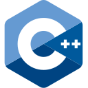

<!--
**Ju5tADeve10per/Ju5tADeve10per** is a ✨ _special_ ✨ repository because its `README.md` (this file) appears on your GitHub profile.
-->
# :wrench: Skills

    
    
    
    
    
    
    

# :bar_chart: Stats
<!-- STATS_START -->
### Organisation 
*Includes collaborative projects*

<ul>
    <li>🧩 Repositories: 3</li>
    <li>⭐ Stars: 0</li>
    <li>⚙️ Languages: <pre>CSS       : ██████████ 52.7%
HTML      : ██████ 34.0%
JavaScript: ██ 13.3%
</pre></li>
    <li>🌱 Total Code Size: 40.9 KB</li>
</ul>

### Personal

<ul>
    <li>🧩 Repositories: 5</li>
    <li>⭐ Stars: 0</li>
    <li>⚙️ Languages: <pre>Python    : ████████████ 62.4%
TypeScript: ██ 10.3%
CSS       : █ 8.4%
Rust      : █ 2.1%
HTML      : █ 1.1%
C++       : ███ 15.6%
</pre></li>
    <li>🌱 Total Code Size: 33.5 KB</li>
</ul>
<!-- STATS_END -->

# :link: Links
- Personal: Under development
- Studio: [Insplash](https://studio-insplash.github.io/)